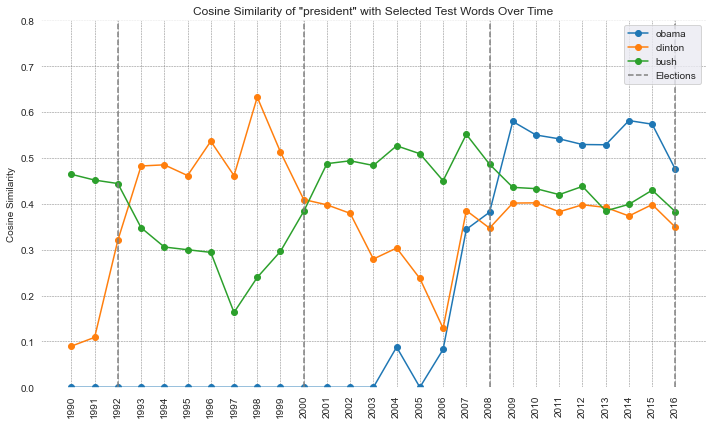

# Temporal Word Embeddings via TPPMI

**Published at CPSS @ KONVENS 2024** — *4th Workshop on Computational Linguistics for the Political and Social Sciences*, ACL Anthology ([2024.cpss-1.10](https://aclanthology.org/2024.cpss-1.10/))

A from-scratch implementation of **Temporal Pointwise Mutual Information (TPPMI)** for tracking semantic change in language over time. Evaluated on temporal word analogy benchmarks against TWEC and static Word2Vec baselines.

---

## Overview

Words change meaning. "Cloud" meant something different before 2006. "Tweet" before 2009. Tracking these shifts requires embeddings that are not just context-sensitive, but *time-sensitive*.

This project implements TPPMI — a count-based approach to temporal word embeddings — and evaluates it on 27 years of New York Times articles (1990–2016) and 11 months of social media data (2022–2023). The quantitative evaluation reproduces the benchmark from Di Carlo et al. (2019) using temporal word analogy test sets from Yao et al. (2018).

**Highlights:**
- Achieves MP@10 of 0.475 on dynamic temporal analogies using only count-based statistics — no neural training required
- Custom TPPMI implementation with cubic spline smoothing across time steps
- Evaluated against TWEC and StaticWord2Vec on 8,272 temporal analogy queries
- Sensitivity analysis across embedding dimensions (200 → 5,000 context words)
- Qualitative analysis: cosine similarity trajectories, 2D PCA/t-SNE projections

---

## Method

The pipeline has four stages:

```
Raw corpus  →  Tokenize & split by time  →  PPMI matrix per slice  →  TPPMI model  →  Evaluation
```

**1. Corpus slicing:** The corpus is split into discrete time windows (yearly for NYT, monthly/quarterly for social media). Each slice is treated as an independent snapshot of language at that time.

**2. PPMI per time step:** A PPMI matrix is computed for each slice using a sliding window (size 5). The vocabulary axis is the full word set; the context axis is fixed to the top-N most frequent words across all time steps (shared context space).

**3. Temporal assembly:** The per-slice PPMI matrices are stacked into a 3D tensor (words × context × time). Cubic spline interpolation is applied along the time axis for each context dimension, smoothing out discontinuities caused by sparse data in individual slices.

**4. Evaluation:** For a target word at a given year, the model retrieves its TPPMI vector and finds the K nearest neighbors by cosine similarity. Performance is measured by MRR@K and MP@K on temporal analogy pairs.

---

## TPPMI: Temporal Pointwise Mutual Information

### Intuition

PPMI captures how strongly a word and a context word co-occur compared to chance. A high PPMI between "bank" and "loan" means they appear together far more often than random co-occurrence would predict — indicating a strong semantic association.

TPPMI extends this idea across time: instead of a single static vector per word, each word gets a *trajectory* — a sequence of PPMI vectors, one per time step. By comparing how these trajectories evolve, we can detect and quantify semantic drift.

### PPMI Formula

For a word $w$ and context word $c$:

$$\text{PPMI}(w, c) = \max\left(\log \frac{P(w, c)}{P(w) \cdot P(c)},\ 0\right)$$

where probabilities are estimated from co-occurrence counts with a sliding window:

$$P(w, c) = \frac{\text{count}(w, c)}{\sum_{w', c'} \text{count}(w', c')}$$

The $\max(\cdot, 0)$ discards negative PMI values, which are noisy at low counts.

### Temporal Extension

Let $M^{(t)} \in \mathbb{R}^{|V| \times |C|}$ be the PPMI matrix for time step $t$, where $|V|$ is the vocabulary size and $|C|$ is the fixed set of context words (shared across all time steps).

The TPPMI representation of word $w$ is a matrix:

$$\mathbf{T}_w = \left[ \mathbf{m}_w^{(1)},\ \mathbf{m}_w^{(2)},\ \ldots,\ \mathbf{m}_w^{(T)} \right] \in \mathbb{R}^{T \times |C|}$$

where $\mathbf{m}_w^{(t)}$ is the row of $M^{(t)}$ corresponding to word $w$.

**Temporal smoothing:** To reduce noise from corpus size variation across slices, cubic spline interpolation is applied independently along each context dimension:

$$\tilde{m}_{w,c}(t) = \text{CubicSpline}\left(\{t_1, \ldots, t_T\},\ \{m_{w,c}^{(1)}, \ldots, m_{w,c}^{(T)}\}\right)$$

This produces smooth, continuous word trajectories without sacrificing the per-slice PPMI structure.

**Semantic drift** is measured as total displacement of the word vector over time:

$$\text{drift}(w) = \sum_{t=1}^{T-1} \left\| \mathbf{m}_w^{(t+1)} - \mathbf{m}_w^{(t)} \right\|_2$$

---

## Datasets

| Dataset | Size | Period | Split | Source |
|---|---|---|---|---|
| New York Times | 99,872 articles | 1990–2016 | Yearly (27 slices) | Yao et al. 2018 |
| Social Media | Education-domain posts | Jun 2022–Apr 2023 | Monthly (11) / Quarterly (4) | Collected |

**Test set:** 8,272 temporal word analogy queries (369 unique) from Yao et al. 2018, filtered to PERSON entities. Split into static (2,333) and dynamic (5,938) subsets.

---

## Results

Models are evaluated on the temporal analogy task: given a word at time $t_1$, retrieve the word that holds the same role at time $t_2$ (e.g. *2004:bush = 2012:?* → *obama*). Evaluated separately on **static** analogies (same target word) and **dynamic** analogies (different target word).

| Model | Subset | MRR@10 | MP@1 | MP@3 | MP@5 | MP@10 |
|---|---|---|---|---|---|---|
| TWEC | Static | 0.668 | 0.591 | 0.723 | 0.768 | 0.818 |
| TWEC | Dynamic | **0.402** | **0.326** | **0.455** | **0.508** | **0.560** |
| TPPMI (ours) | Static | 0.592 | 0.493 | 0.663 | 0.729 | 0.791 |
| TPPMI (ours) | Dynamic | 0.302 | 0.225 | 0.348 | 0.409 | 0.475 |
| SW2V (baseline) | Static | 1.000 | 1.000 | 1.000 | 1.000 | 1.000 |
| SW2V (baseline) | Dynamic | 0.322 | 0.000 | 0.709 | 0.741 | 0.813 |

TPPMI reaches MP@10 of **0.791 on static** and **0.475 on dynamic** analogies using only count-based statistics — no neural training required. The dynamic subset is the meaningful benchmark: SW2V scores 0.0 MP@1 there by construction.

**Qualitative example:** Cosine similarity of "president" with U.S. president names over 1990–2016. Dotted lines mark election years. TPPMI captures the transitions without any supervision.



**Sensitivity analysis:** TPPMI models with 200, 500, 1,000, and 5,000 context words are compared qualitatively on social media data via cosine similarity trajectories. Higher context word counts yield smoother and more stable trajectories, with diminishing returns beyond 1,000. See `notebooks/analysis-quantitative/sensitivity-analysis-tppmi.ipynb`.

---

## Repository Structure

```
├── src/
│   ├── packages/TPPMI/
│   │   ├── ppmi_model.py         # PPMI matrix computation for a single time step
│   │   ├── tppmi_model.py        # Temporal assembly, smoothing, drift, similarity
│   │   ├── tppmi_functions.py    # Corpus utilities and PPMI helpers
│   │   └── tppmi_creation.py     # Pipeline for building TPPMI from raw corpora
│   ├── test/
│   │   └── util.py               # MRR@K and MP@K evaluation
│   └── visualization/
│       └── embedding_visualization.py   # PCA/t-SNE projections, cosine similarity plots
│
├── notebooks/
│   ├── preprocessing/            # Tokenization, time-splitting, test set filtering
│   ├── training/                 # PPMI matrix creation and TPPMI assembly
│   ├── analysis-quantitative/    # Benchmark evaluation, sensitivity analysis
│   └── analysis-qualitative/     # Word trajectory visualization, model probing
│
├── model/                        # Serialized models (sparse .npz + vocab .pkl)
├── environment.yml
└── requirements.txt
```

---

## Usage

### Installation

```bash
git clone https://github.com/FlackoJodye1/temporal-word-embeddings.git
cd temporal-word-embeddings
conda env create -f environment.yml
conda activate temporal-word-embeddings
```

### Reproducing the NYT experiment

```bash
# 1. Obtain the NYT dataset (Yao et al. 2018) and place it in model/nyt-data/cade/data/
# 2. Download the Pantheon entity dataset: https://www.nature.com/articles/sdata201575
#    Place it in data/raw/

# Preprocessing
notebooks/preprocessing/preprocessing-pantheon-dataset.ipynb
notebooks/preprocessing/filter-testsets.ipynb
notebooks/preprocessing/preprocessing-nyt-data.ipynb

# Training
notebooks/training/create-ppmi-nyt-data.ipynb
notebooks/training/train-models-nyt-data.ipynb

# Evaluation
notebooks/analysis-quantitative/model-comparison.ipynb
```

### Using TPPMI directly

```python
from src.packages.TPPMI.ppmi_model import PPMIModel
from src.packages.TPPMI.tppmi_model import TPPMIModel

# Build one PPMIModel per time step
# text_df: pd.DataFrame with a 'text' column containing tokenized documents
ppmi_models = {
    1990: PPMIModel(text_df=df_1990, context_words=context_words),
    1991: PPMIModel(text_df=df_1991, context_words=context_words),
    # ...
}

# Assemble into a temporal model
tppmi = TPPMIModel(ppmi_models=ppmi_models, dates=list(ppmi_models.keys()), smooth=True)

# Retrieve embedding at a specific time step
vector_1995 = tppmi.get_tppmi(target_words=["clinton"], selected_months=[1995])

# Most similar words at a given time
tppmi.most_similar_words_by_vector(vector_1995, top_n=10)

# Quantify semantic drift over the full period
tppmi.calculate_absolute_drift("clinton")

# Identify words with the largest semantic shift
tppmi.calculate_top_n_drift(top_n=20)
```

---

## Tech Stack

- **Core:** NumPy, SciPy (sparse matrices, spline interpolation)
- **NLP:** NLTK (tokenization), Gensim (Word2Vec / TWEC baseline)
- **Evaluation:** scikit-learn (cosine similarity, PCA, t-SNE)
- **Visualization:** Matplotlib, Plotly
- **Environment:** Python 3.11, Conda

---

## References

- Schmitt, P. et al. (2024). *TPPMI — a Temporal Positive Pointwise Mutual Information Embedding of Words.* CPSS @ KONVENS 2024. [ACL Anthology](https://aclanthology.org/2024.cpss-1.10/)
- Di Carlo, V. et al. (2019). *Training Temporal Word Embeddings with a Compass.* AAAI 2019.
- Yao, Z. et al. (2018). *Dynamic Word Embeddings for Evolving Semantic Discovery.* WSDM 2018.